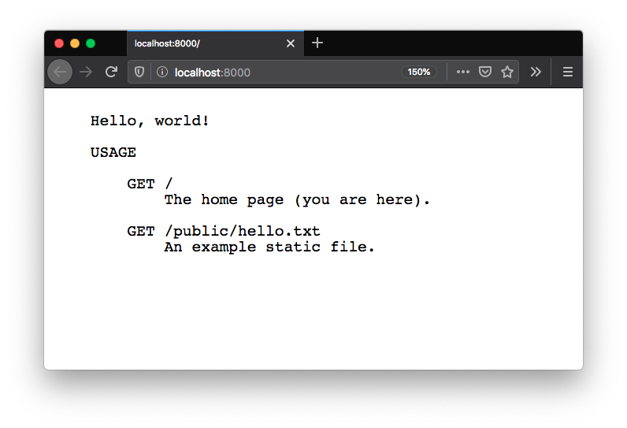

# hello-rocket

Getting started with [Rust](https://www.rust-lang.org/) by building a tiny web service using [Rocket](https://rocket.rs/). Inspired by the Rocket [Getting Started](https://rocket.rs/v0.4/guide/getting-started/) guide.

## Getting started

- Install [Rustup](https://rustup.rs/), then install Rust (nightly).
- Run the server:

```bash
cargo run
```

- Access http://localhost:8000



## Notes

The `src/main.rs` crate file is annotated with various notes and links to the Rust language documentation. Just me trying to understand the many concepts of Rust used in this "Hello, world!" example, e.g.:

- [Crates](https://doc.rust-lang.org/rust-by-example/crates.html)
- [Linking crates](https://doc.rust-lang.org/rust-by-example/crates/link.html)
- [Attributes](https://doc.rust-lang.org/reference/attributes.html)
- [Lifetimes](https://doc.rust-lang.org/rust-by-example/scope/lifetime.html)
- [Static lifetime](https://doc.rust-lang.org/rust-by-example/scope/lifetime/static_lifetime.html)
- [Borrowing](https://doc.rust-lang.org/rust-by-example/scope/borrow.html)
- [Macros](https://doc.rust-lang.org/1.7.0/book/macros.html)
- [Macro import/export](https://doc.rust-lang.org/1.7.0/book/macros.html#scoping-and-macro-importexport)
- [Methods](https://doc.rust-lang.org/1.7.0/book/method-syntax.html)

# License

MIT
